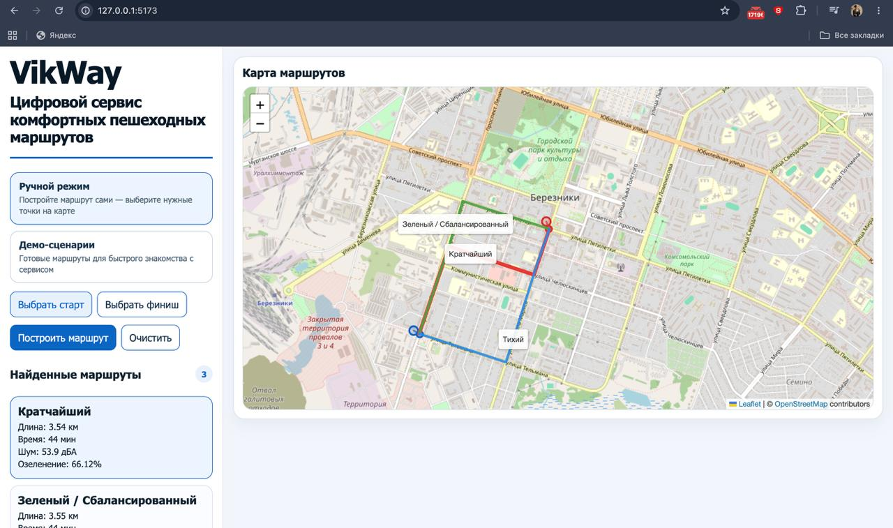

# VikWay

Обычно навигатор предлагает самый короткий маршрут, но для пешехода это не всегда самый комфортный вариант

VikWay позволяет сравнивать пути не только по длине, но и по примерному уровню шума и количеству зелени вокруг

Сейчас сервис работает на фрагменте уличной сети Березников и показывает кратчайший, тихий, зелёный и сбалансированный варианты



## Возможности

- выбрать старт и финиш на карте
- построить несколько вариантов пешеходного маршрута
- сравнить длину, примерное время, шум и озеленение
- открыть готовые демонстрационные сценарии
- использовать сервис на компьютере и телефоне

## Режимы

| Режим | Принцип выбора |
| --- | --- |
| Кратчайший | минимальная длина пути |
| Тихий | меньший вес участков рядом с шумными дорогами и железной дорогой |
| Зелёный | больший приоритет участков рядом с зелёными объектами |
| Сбалансированный | совместный учёт длины, шума и озеленения |

Если несколько режимов находят одинаковый путь, сервис объединяет их в одну линию и одну карточку

## Как работает маршрутизация

Сервис привязывает выбранные точки к ближайшим подходящим узлам пешеходного графа

Для каждого режима используется алгоритм кратчайшего пути и отдельный набор весов

Шум оценивается по типу дороги, числу полос, ограничению скорости и близости железной дороги

Озеленение оценивается по типу пешеходного участка и близости зелёных объектов

Совпадающие маршруты объединяются, после чего результат передаётся на карту

Оценки шума и озеленения являются приближёнными

Коэффициенты заданы вручную и пока не обучаются на пользовательских данных

## Технологии

- Python и FastAPI для API
- NetworkX для работы с графом
- NumPy, Shapely, pyproj и GeoPandas для пространственных данных
- React и Vite для интерфейса
- Leaflet и OpenStreetMap для карты

## Структура проекта

```text
backend/
  app/                 API, загрузка данных и маршрутизация
  data/export/         граф и пространственные слои
  tests/               тесты текущего поведения

frontend/
  src/                 исходный код интерфейса
  dist/                production-сборка
```

## Запуск на macOS

Установить Python 3.11, Node.js 18 или новее и npm

Открыть терминал в корне проекта и создать виртуальное окружение

```bash
python3.11 -m venv .venv
source .venv/bin/activate
```

Перейти в backend, установить зависимости и запустить API

```bash
cd backend
python -m pip install --upgrade pip
python -m pip install -r requirements.txt
uvicorn app.main:app --reload --host 127.0.0.1 --port 8001
```

Проверить работу backend

```text
http://127.0.0.1:8001/api/health
```

Оставить backend запущенным и открыть второй терминал в корне проекта

```bash
cd frontend
cp .env.example .env
npm ci
npm run dev
```

Открыть адрес, который покажет Vite

```text
http://127.0.0.1:5173
```

## Проверка

Запустить тесты из корня проекта

```bash
source .venv/bin/activate
PYTHONPATH=backend python -m unittest discover -s backend/tests -v
```

Проверить production-сборку интерфейса

```bash
cd frontend
npm ci
npm run build
```

## Данные

В проекте используются подготовленный пешеходный граф и пространственные слои из `backend/data/export`

При использовании данных необходимо сохранять атрибуцию OpenStreetMap и учитывать условия лицензии ODbL

Подробнее об использовании данных на [странице OpenStreetMap](https://www.openstreetmap.org/copyright)

Полный скрипт подготовки данных пока не добавлен в репозиторий

## Следующий этап

План следующего этапа — перейти от вручную заданных режимов к изучению индивидуальных предпочтений пешеходов

Участникам будут показаны пары маршрутов, между которыми нужно сделать выбор

Сравнить три подхода

- фиксированные правила текущего прототипа
- общую модель для всех участников
- персонализированную модель

Модель будет использоваться только для предсказания выбора между готовыми маршрутами

Построение маршрутов останется задачей графового алгоритма

Исследовательская часть пока не реализована в приложении

## Ограничения

- приближённые оценки шума и озеленения
- ограниченная территория текущего прототипа
- меньше четырёх разных линий, если режимы выбирают одинаковый путь
- отсутствие воспроизводимого процесса подготовки пространственных данных

## Автор

Виктория Чекалина

Проект разработан самостоятельно как учебный и исследовательский прототип

Первое место в индивидуальном зачёте Future Makers 2026

## Лицензия

Лицензия на программный код будет выбрана после отдельной проверки прав на код и пространственные данные
